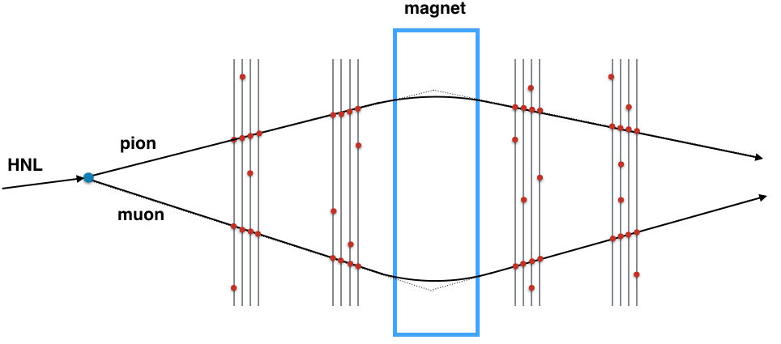

# SHiP Tracks Pattern Recognition

# Introduction

The purpose of the SHiP spectrometer tracker is to reconstruct the tracks of charged particles from the decay of neutral New Physics objects with high efficiency, while rejecting background events. Additionally, the spectrometer tracker must provide as good as possible measurements of the track momentum and of the flight direction within the fiducial decay volume.

# Method description

A base tracks pattern recognition method is described in an [article](https://cds.cern.ch/record/2005715/files/main.pdf).
Main stages of these solution have been realized here.

# TODO

Use machine learning techniques to improve efficiecy of the pattern recognition.
